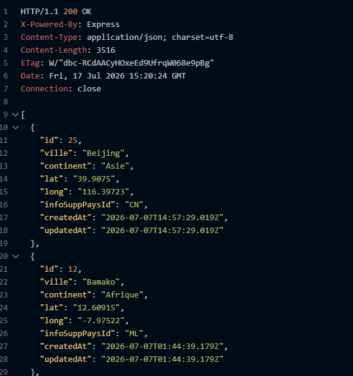
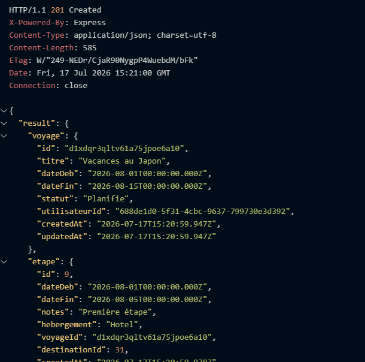

# TP1 - Services Web

# Backend d'une application de planification de voyages

### Étudiants : Jean-François Pierre, Nadjib Ammour et Amit Chandel

## Présentation

Dans ce projet de création d'une application de voyages, nous avons créé toute la structure en backend pour créer des routes qui permettent de faire le CRUD des utilsateurs de la platerformes, des destinations de voyages, des voyages contenant plusieurs étapes dans diverses villes, des avis sur les destinations, ainsi que la gestion des authentifications et des autorisations de l'application.

## Comment activer l'application

#### Ouvrez un éditeur de code et entrez la commande suivante dans le terminal :

git clone https://github.com/CoursServicesWeb/planificateur-voyages.git

#### Ensuite, assurez-vous d'avoir la plateforme Node.js d'installée sur votre ordinateur, et de posséder un compte sur Néon. Entrez ensuite les commandes suivantes :

- cd backend
- npm install

#### Puis, créez un fichier .env et déclarez une variable DATABASE_URL qui correspond au URL d'une nouvelle base de données vide que vous créez sur Neon.

#### Ensuite, entrez la commande suivante dans le terminal :

- node -e "console.log(require('crypto').randomBytes(32).toString('hex'))"

#### Copiez la châine de caractères générée et insérez-là dans une variable appelée JWT_SECRET dans .env. Après, exécutez les commandes ci-dessous :

- npx prisma migrate dev --name init
- npx prisma generate
- npm run dev

#### Le serveur (sur votre localhost:3000) est maintenant prêt à gérer les requêtes HTTP.

## Objectifs du projet :

- Apprendre à manipuler une base de données PostgreSQL (hébergée sur Neon) en utilisant Prisma.
- Se familiariser avec le framework express pour gérer les routes et les requêtes HTTP dans un serveur.
- Se servir de la librairie axios pour appeler des API externes.
- Apprendre à gérer le "hashage" des mots de passe avec bcrypt, ainsi que les authentifications et les autorisations avec JWT.
- Créer des routes et des fonctions pour gérer tout le CRUD des différentes tables d'une base de données.

## Outils requis pour le projet :

- Node.js
- Neon

## Fonctionnalités de l'application :

- CRUD des différentes destinations de voyage, ainsi que des informations sur le pays dans lequel elles sont situées.
- CRUD des comptes utilisateurs et gestion des authentifications et des autorisations.
- CRUD de voyages avec plusieurs étapes dans différentes destinations, et affichage de la météo pour ces étapes.
- CRUD des avis des voyageurs sur les destinations qu'ils ont visité.
- Affichage des destinations filtrées par continent.
- Calcul de la note moyenne des avis laissés par les utilsateurs.

## Liste des routes implémentées :

- auth
- voyages
- etapes
- destinations
- api/pays
- avis
